# Проект "Кинотеатр"

## Описание проекта.

Проект представляет собой web-приложение по покупке билетов в кинотеатр. Сервис состоит из:

- главной страницы, которая выводит общую информацию о ресурсе;
- кинотеки, которая содержит список всех фильмов, находящихся в кинопрокате. Для получения подробной информации об
  интересующим фильме, можно перейти на страницу с содержанием фильма;
- списка залов, где можно ознакомиться с информации о залах в кинотеатре;
- расписания, которое позволяет выбрать сеанс и связанный с ним фильм. Затем перейти на страницу покупки билета, где,
  указав предпочтительный ряд и место, приобрести билет, либо отказать от покупки;
- страницы регистрации и авторизации пользователя.

## Стек технологий.

- **Java 17**
- **Spring Boot 2.7.6**
- **HTML 5**
- **Thymeleaf 2.7.6**
- **BOOTSTRAP 4.4.1**
- **PostgreSQL 14**
- **Liquibase 4.15.0**
- **sql2o 1.6.0**
- **H2 1.4.2**
- **Mockito 4.8.0**
- **Junit 5.8.2**

## Требования к окружению.

- **Java 17**
- **Maven 3.8**
- **PostgresSQL 14**

## Запуск проекта.

- **Создать БД**

``` shell 
create database dreamjob;
```

- **Запустить проект по команде**

``` shell 
mvn spring-boot:run
```

## Взаимодействие с приложением.

На главной странице выведена общая информация о ресурсе.
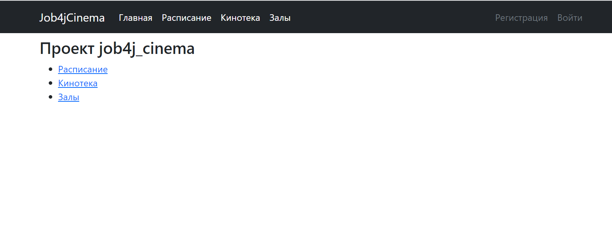

На странице с кинотекой выведен список фильмов.
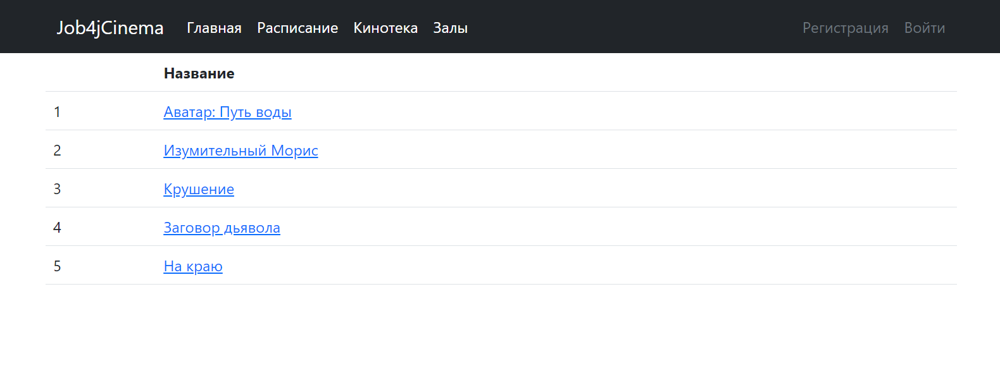

Чтобы получить информацию о фильме, необходимо перейти на его страницу.
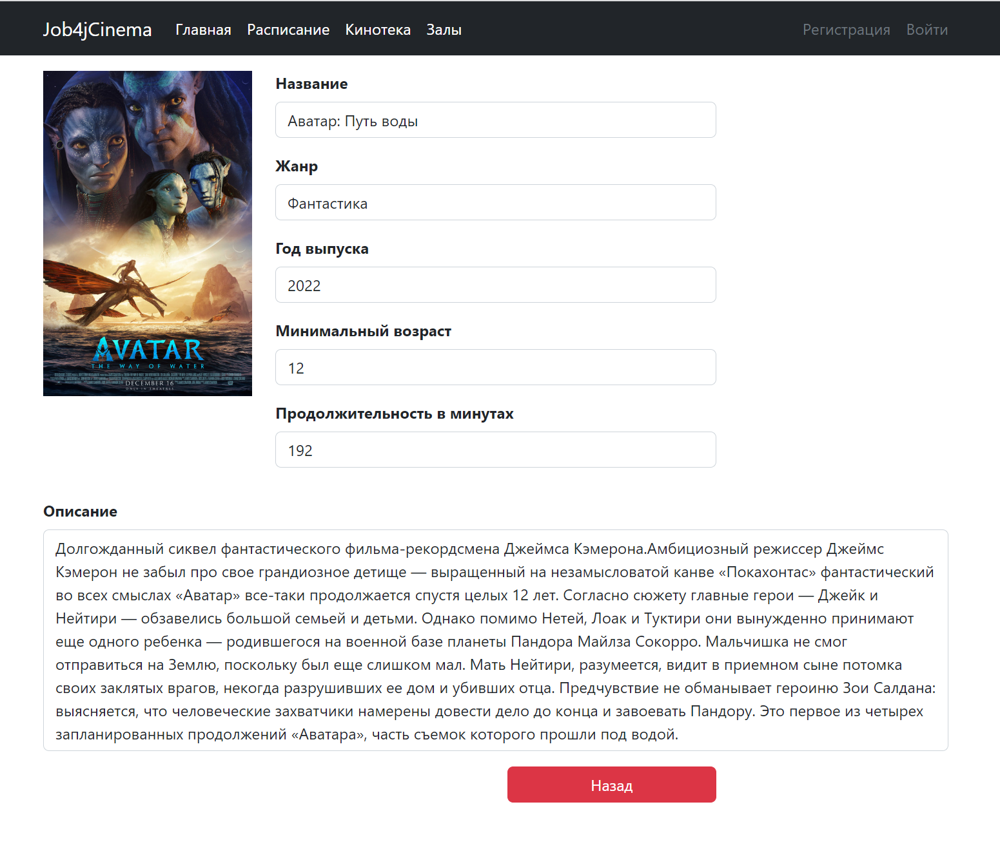

На странице с залами выведена информация о них.
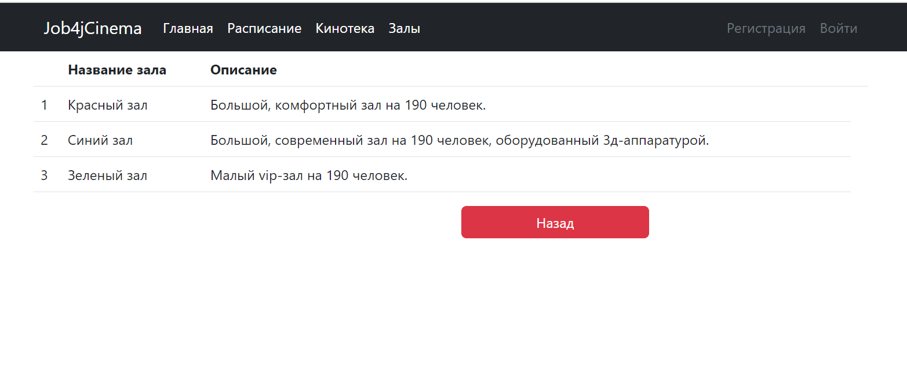

На странице с расписанием выведены сеансы и связанные с ними фильмы.
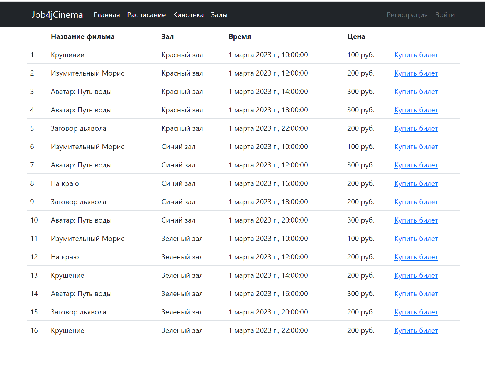

Купить билет может только зарегистрированный пользователь. Форма регистрации.
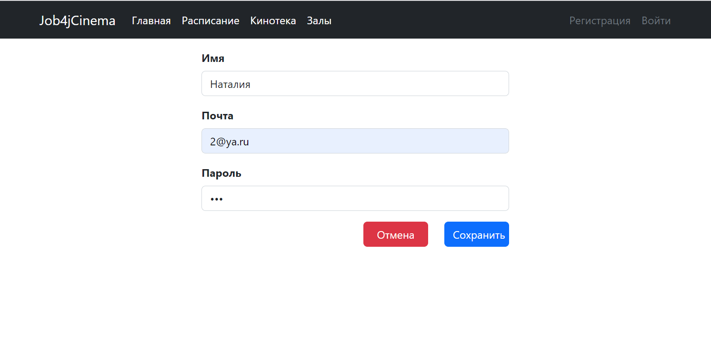

Форма для авторизации.
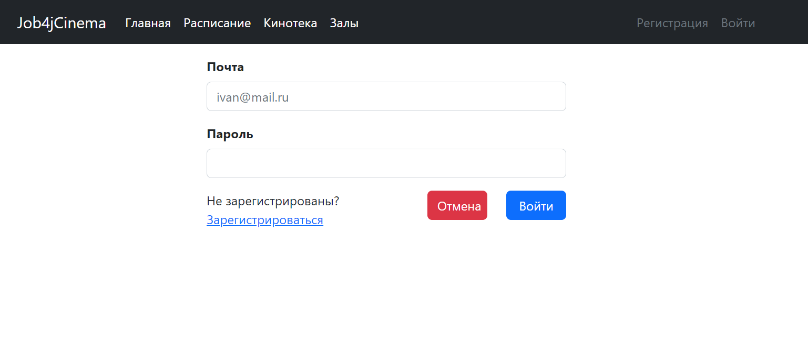

Если пользователь ввел неверные данные, то выйдет сообщение об ошибке.
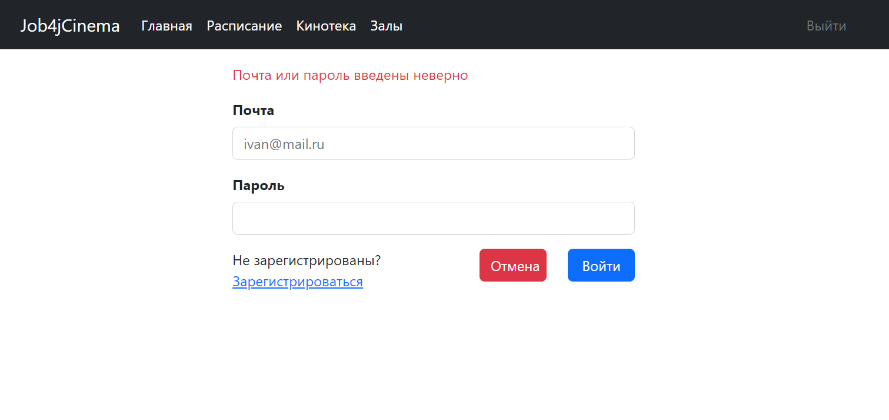

Зарегистрированный пользователь может приобрести билет, указав необходимые ряд и место.
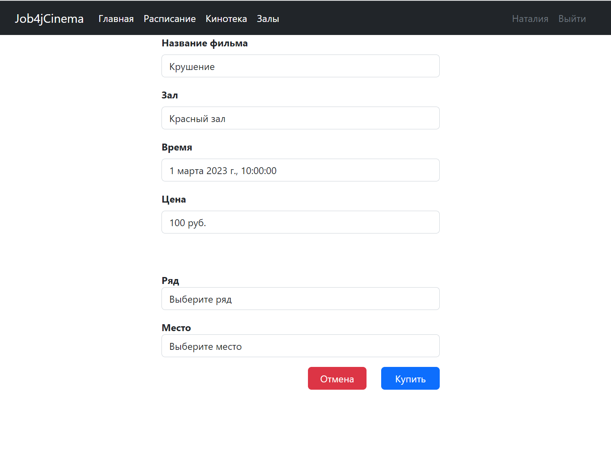

Если выбранное место не занято, то выйдет сообщение об удачной покупке.
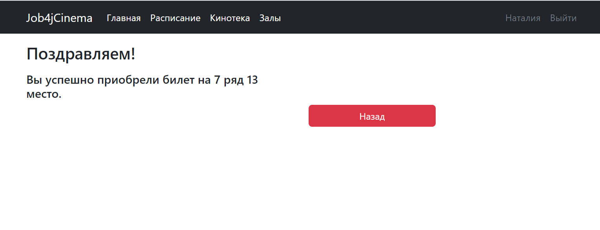

Если выбранное место занято, то выйдет сообщение о неудачной покупке.
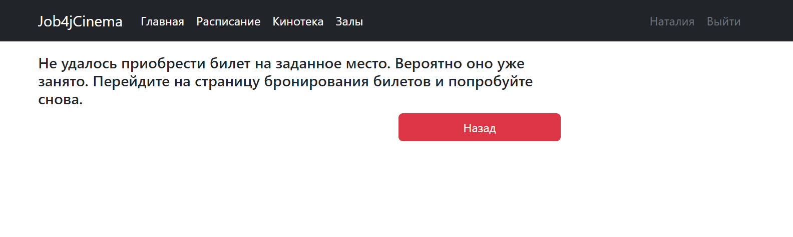

## Контакты.
- nataliya-mar@mail.ru
- <a href="https://t.me/khmnatalia/" target="_blank">Телеграм</a></h1>
